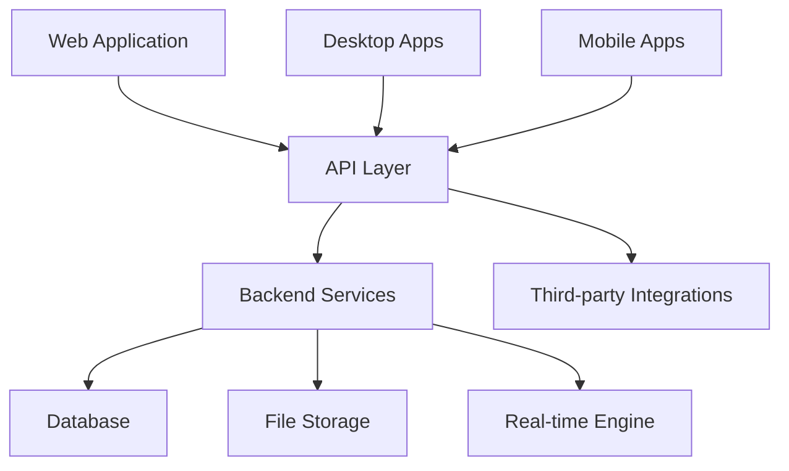
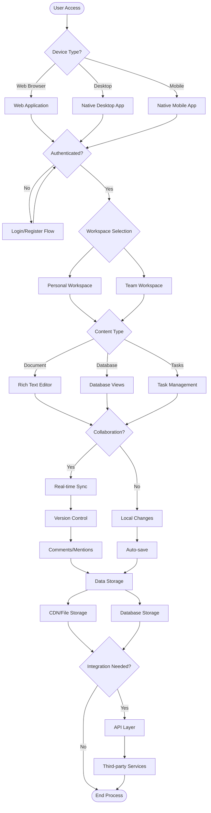
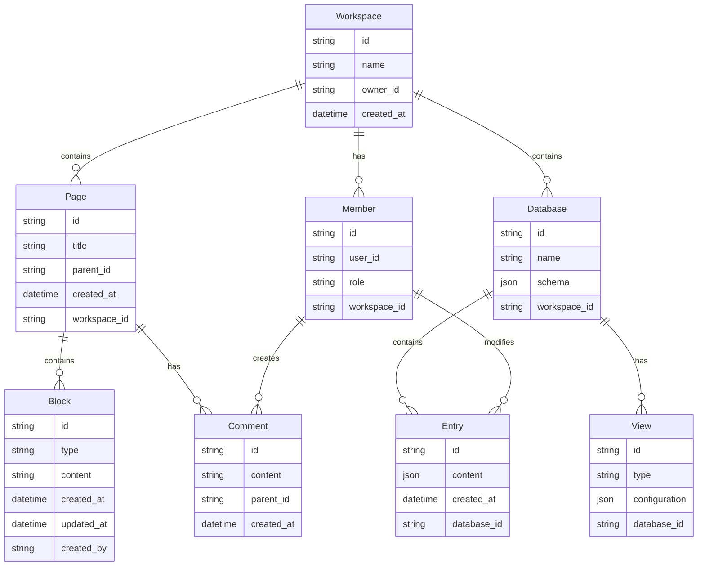
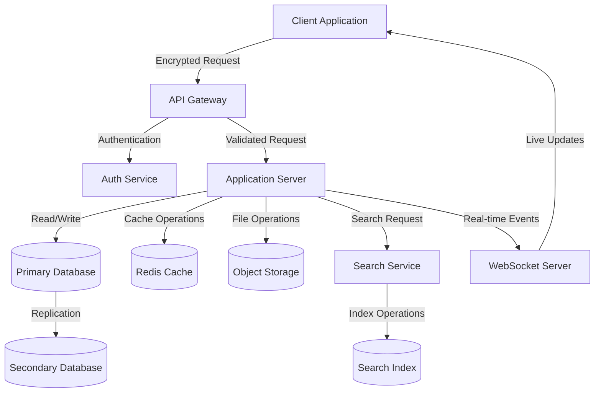
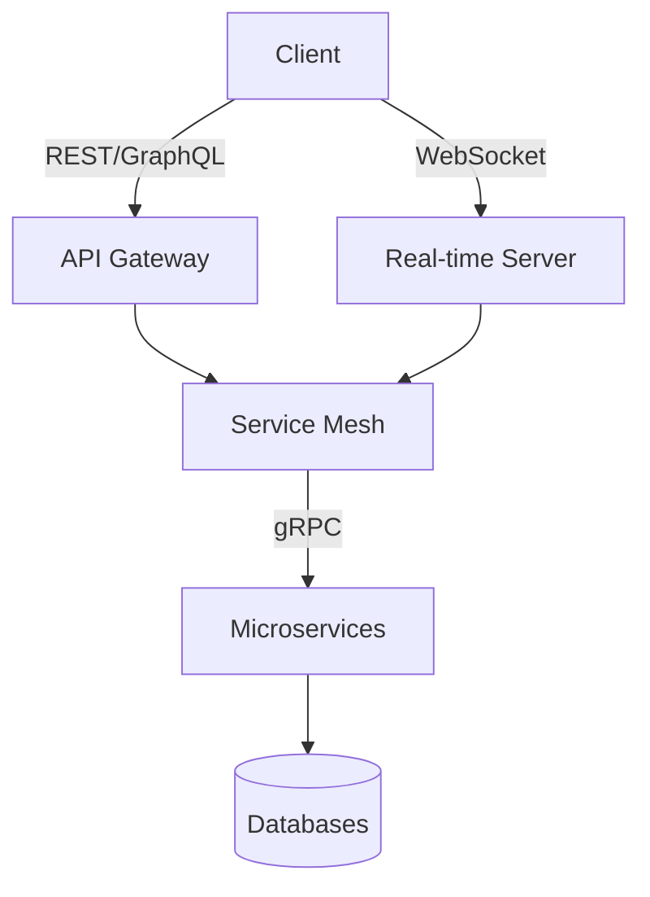

# Product Requirements Document (PRD)

# 1. INTRODUCTION

## 1.1 Purpose

This Software Requirements Specification (SRS) document provides a comprehensive description of the all-in-one productivity platform. It details the functional and non-functional requirements for developers, project managers, QA teams, and stakeholders involved in the development process. The document serves as the primary reference for technical implementation and validation of the system.

## 1.2 Scope

The productivity platform encompasses a web-based and native application ecosystem designed to unify workspace management, collaboration, and productivity tools. The system will include:

- Hierarchical document management with rich text editing capabilities
- Database-driven content organization (tables, kanban boards, calendars)
- Real-time collaboration features with version control
- Task and project management functionalities
- Cross-platform compatibility (Web, macOS, Windows, iOS, Android)
- Third-party integration capabilities
- Automated workflow tools

Key benefits:
- Centralized workspace for individuals and teams
- Reduced context switching between different tools
- Improved team collaboration and knowledge sharing
- Flexible organization systems adaptable to various use cases
- Streamlined project and task management

Out of scope:
- Enterprise resource planning (ERP) features
- Customer relationship management (CRM) functionality
- Financial management tools
- Time tracking and billing systems

# 2. PRODUCT DESCRIPTION

## 2.1 Product Perspective

The productivity platform operates as a standalone system while integrating with existing productivity tools and services. The system architecture consists of:

- Cloud-based backend infrastructure for data storage and synchronization
- Web application frontend for browser-based access
- Native desktop and mobile applications
- REST API layer for third-party integrations
- Real-time collaboration engine
- Version control system for content management

System Context Diagram:

## 2.2 Product Functions

- Document Creation and Management
  - Rich text editing with markdown support
  - Media embedding and file attachments
  - Version control and change history
  
- Database Management
  - Custom database creation and configuration
  - Multiple view types (table, kanban, calendar, gallery)
  - Relationship management between databases
  
- Collaboration Features
  - Real-time multi-user editing
  - Comments and @mentions
  - Sharing and permission management
  
- Task and Project Management
  - Task creation and assignment
  - Progress tracking and status updates
  - Timeline and deadline management

## 2.3 User Characteristics

| User Type | Characteristics | Technical Expertise | Primary Use Cases |
|-----------|----------------|---------------------|-------------------|
| Individual Users | Self-motivated, organization-focused | Basic to Intermediate | Personal knowledge management, task tracking |
| Team Members | Collaborative, deadline-driven | Intermediate | Project collaboration, document sharing |
| Team Leaders | Decision makers, process-oriented | Intermediate to Advanced | Workflow management, team coordination |
| Administrators | Technical, system-focused | Advanced | System configuration, user management |

## 2.4 Constraints

Technical Constraints:
- Must support modern web browsers (Chrome, Firefox, Safari, Edge)
- Mobile apps limited to iOS 14+ and Android 8+
- Maximum file upload size of 100MB per file
- API rate limiting of 1000 requests per hour per user

Regulatory Constraints:
- GDPR compliance for EU users
- CCPA compliance for California users
- SOC 2 Type II compliance requirements
- Data residency requirements for specific regions

Business Constraints:
- Initial release timeline of 12 months
- Development budget cap of $2M for MVP
- Team size limited to 20 developers

## 2.5 Assumptions and Dependencies

Assumptions:
- Users have stable internet connectivity (minimum 1Mbps)
- Users possess basic computer literacy
- Market demand for integrated productivity solutions remains stable
- Third-party services maintain their current API specifications

Dependencies:
- Cloud infrastructure providers (AWS/GCP)
- Third-party authentication services
- External storage providers for file handling
- Payment processing services
- Content delivery networks (CDN)
- Mobile platform app stores

# 3. PROCESS FLOWCHART

# 4. FUNCTIONAL REQUIREMENTS

## 4.1 Document Management

### ID: FR-DM-001
### Description
Core document creation and management functionality with hierarchical organization and rich text editing capabilities.
### Priority: High

| Requirement ID | Requirement Description | Acceptance Criteria |
|---------------|------------------------|-------------------|
| FR-DM-001.1 | Users can create, edit, and delete documents with rich text formatting | - Support for headers, lists, tables, and code blocks - Real-time formatting preview - Markdown syntax support |
| FR-DM-001.2 | Documents support hierarchical organization with unlimited nesting | - Drag-and-drop reordering - Collapsible sections - Visual hierarchy indicators |
| FR-DM-001.3 | Media embedding capabilities for images, videos, and files | - Support files up to 100MB - Preview for common file types - CDN integration for media storage |
| FR-DM-001.4 | Version control system for document changes | - Automatic version creation - Ability to restore previous versions - Change comparison view |

## 4.2 Database Management

### ID: FR-DB-001
### Description
Flexible database system supporting multiple view types and relationships between data.
### Priority: High

| Requirement ID | Requirement Description | Acceptance Criteria |
|---------------|------------------------|-------------------|
| FR-DB-001.1 | Create and configure custom databases with multiple field types | - Support for text, number, date, select, and relation fields - Custom field validation rules - Bulk field operations |
| FR-DB-001.2 | Multiple view types for database visualization | - Table view - Kanban board - Calendar view - Gallery view |
| FR-DB-001.3 | Database relationships and lookups | - One-to-one relationships - One-to-many relationships - Many-to-many relationships - Rollup fields |
| FR-DB-001.4 | Filtering and sorting capabilities | - Multiple filter conditions - Custom sort orders - Saved filter/sort configurations |

## 4.3 Collaboration Features

### ID: FR-CO-001
### Description
Real-time collaboration tools enabling multiple users to work together seamlessly.
### Priority: High

| Requirement ID | Requirement Description | Acceptance Criteria |
|---------------|------------------------|-------------------|
| FR-CO-001.1 | Real-time multi-user editing | - Concurrent editing support - User presence indicators - Conflict resolution |
| FR-CO-001.2 | Comments and @mentions system | - Thread-based comments - User notifications - Comment resolution tracking |
| FR-CO-001.3 | Sharing and permission management | - Granular permission levels - Link sharing - Guest access support |
| FR-CO-001.4 | Activity tracking and notifications | - User activity feed - Email notifications - In-app notifications |

## 4.4 Task Management

### ID: FR-TM-001
### Description
Comprehensive task and project management functionality.
### Priority: Medium

| Requirement ID | Requirement Description | Acceptance Criteria |
|---------------|------------------------|-------------------|
| FR-TM-001.1 | Task creation and assignment | - Due dates - Priority levels - Task dependencies |
| FR-TM-001.2 | Progress tracking and status updates | - Custom status workflows - Progress indicators - Time tracking |
| FR-TM-001.3 | Timeline and deadline management | - Gantt chart view - Calendar integration - Deadline notifications |
| FR-TM-001.4 | Task organization and categorization | - Tags and labels - Custom fields - Bulk task operations |

## 4.5 Integration Capabilities

### ID: FR-IN-001
### Description
Third-party integration support and API functionality.
### Priority: Medium

| Requirement ID | Requirement Description | Acceptance Criteria |
|---------------|------------------------|-------------------|
| FR-IN-001.1 | REST API implementation | - Authentication endpoints - CRUD operations - Rate limiting compliance |
| FR-IN-001.2 | Third-party service connections | - OAuth authentication - Data synchronization - Error handling |
| FR-IN-001.3 | Webhook support | - Custom webhook creation - Event filtering - Retry mechanisms |
| FR-IN-001.4 | Integration marketplace | - Integration discovery - One-click installation - Integration settings management |

# 5. NON-FUNCTIONAL REQUIREMENTS

## 5.1 Performance Requirements

| Requirement ID | Description | Target Metric |
|---------------|-------------|---------------|
| NFR-PF-001 | Page Load Time | Initial page load < 2 seconds at 4G speeds |
| NFR-PF-002 | API Response Time | 95% of API requests < 200ms |
| NFR-PF-003 | Real-time Sync Latency | < 100ms for collaborative editing |
| NFR-PF-004 | Search Response Time | Results displayed within 500ms |
| NFR-PF-005 | Memory Usage | Desktop app < 500MB RAM |
| NFR-PF-006 | Storage Optimization | Image compression to WebP format |
| NFR-PF-007 | Concurrent Users | Support 100 simultaneous users per workspace |
| NFR-PF-008 | Database Query Time | Complex queries < 1 second |

## 5.2 Safety Requirements

| Requirement ID | Description | Implementation |
|---------------|-------------|----------------|
| NFR-SF-001 | Data Backup | Automated hourly backups with 30-day retention |
| NFR-SF-002 | Disaster Recovery | Recovery Point Objective (RPO) < 1 hour |
| NFR-SF-003 | System Recovery | Recovery Time Objective (RTO) < 4 hours |
| NFR-SF-004 | Data Corruption Prevention | Checksums for all file transfers |
| NFR-SF-005 | Failover Systems | Automatic failover to secondary systems |
| NFR-SF-006 | Data Loss Prevention | Auto-save every 30 seconds |

## 5.3 Security Requirements

| Requirement ID | Description | Implementation |
|---------------|-------------|----------------|
| NFR-SC-001 | Authentication | Multi-factor authentication support |
| NFR-SC-002 | Authorization | Role-based access control (RBAC) |
| NFR-SC-003 | Data Encryption | AES-256 encryption at rest |
| NFR-SC-004 | Transport Security | TLS 1.3 for all communications |
| NFR-SC-005 | Session Management | JWT with 24-hour expiration |
| NFR-SC-006 | Password Policy | Minimum 12 characters with complexity requirements |
| NFR-SC-007 | Audit Logging | Comprehensive activity logging |
| NFR-SC-008 | Vulnerability Scanning | Weekly automated security scans |

## 5.4 Quality Requirements

### 5.4.1 Availability
- System uptime: 99.9% (excluding planned maintenance)
- Maximum planned downtime: 4 hours per month
- Unplanned downtime resolution: < 2 hours

### 5.4.2 Maintainability
- Code coverage: Minimum 80%
- Documentation: Updated within 24 hours of changes
- Technical debt: < 20% of development time
- Modular architecture for easy updates

### 5.4.3 Usability
- Learning curve: < 2 hours for basic features
- Error messages: Clear, actionable, and user-friendly
- Accessibility: WCAG 2.1 Level AA compliance
- Mobile responsiveness: All features functional on mobile devices

### 5.4.4 Scalability
- Horizontal scaling: Support for 1M+ users
- Storage scaling: Automatic expansion up to 1PB
- Database scaling: Automatic sharding support
- Load balancing: Dynamic resource allocation

### 5.4.5 Reliability
- Mean Time Between Failures (MTBF): > 720 hours
- Mean Time To Repair (MTTR): < 2 hours
- Error rate: < 0.1% of all operations
- Data integrity: 100% consistency guarantee

## 5.5 Compliance Requirements

| Requirement ID | Description | Standard/Regulation |
|---------------|-------------|-------------------|
| NFR-CP-001 | Data Protection | GDPR, CCPA, PIPEDA |
| NFR-CP-002 | Security Standards | ISO 27001, SOC 2 Type II |
| NFR-CP-003 | Accessibility | WCAG 2.1 Level AA |
| NFR-CP-004 | Data Residency | EU data stored in EU regions |
| NFR-CP-005 | Industry Standards | REST API standards, OAuth 2.0 |
| NFR-CP-006 | Privacy Requirements | Privacy by Design principles |
| NFR-CP-007 | Retention Policies | Data retention configurable per region |
| NFR-CP-008 | Audit Requirements | Complete audit trail for 7 years |

# 6. DATA REQUIREMENTS

## 6.1 Data Models

### 6.1.1 Core Entities Relationship Diagram

## 6.2 Data Storage

### 6.2.1 Storage Architecture

| Data Type | Storage Solution | Retention Policy |
|-----------|-----------------|------------------|
| Workspace Data | PostgreSQL | Indefinite |
| File Attachments | S3-compatible Object Storage | Configurable per workspace |
| Real-time Collaboration | Redis | 24 hours |
| Search Indices | Elasticsearch | Synchronized with source |
| Audit Logs | Time-series Database | 7 years |

### 6.2.2 Backup and Recovery

| Component | Backup Frequency | Retention Period | Recovery SLA |
|-----------|-----------------|------------------|--------------|
| Database | Continuous | 30 days | 1 hour |
| File Storage | Daily | 90 days | 4 hours |
| Configuration | Daily | 365 days | 30 minutes |
| User Data | Hourly | 30 days | 2 hours |

### 6.2.3 Data Redundancy

- Geographic replication across three regions
- Active-active configuration for database clusters
- Cross-region replication for object storage
- Real-time synchronization between data centers

## 6.3 Data Processing

### 6.3.1 Data Flow Diagram

### 6.3.2 Data Security

| Security Layer | Implementation | Description |
|----------------|----------------|-------------|
| Transport | TLS 1.3 | End-to-end encryption for all data in transit |
| Storage | AES-256 | Encryption at rest for all stored data |
| Access Control | RBAC + ABAC | Combined role and attribute-based access control |
| Key Management | KMS | Automated key rotation and secure key storage |
| Field Level | Column Encryption | Additional encryption for sensitive fields |

### 6.3.3 Data Processing Requirements

| Requirement | Specification | Implementation |
|-------------|---------------|----------------|
| Throughput | 10,000 TPS | Horizontally scaled application servers |
| Latency | < 100ms | Global CDN and edge caching |
| Consistency | Strong | Multi-region synchronous replication |
| Search | Real-time | Distributed search cluster with auto-scaling |
| Analytics | Near real-time | Stream processing with Apache Kafka |

# 7. EXTERNAL INTERFACES

## 7.1 User Interfaces

### 7.1.1 Web Application Interface

| Component | Requirements | Implementation |
|-----------|--------------|----------------|
| Responsive Design | Support for viewport sizes 320px to 4K | CSS Grid and Flexbox with breakpoints |
| Navigation | Left sidebar with collapsible sections | React-based component architecture |
| Content Area | Adaptive layout with resizable panels | CSS Grid with drag handles |
| Command Palette | Global search and command interface | Keyboard-first modal interface |
| Toolbar | Context-sensitive formatting options | Floating toolbar with tooltips |

### 7.1.2 Mobile Interface

| Component | Requirements | Implementation |
|-----------|--------------|----------------|
| Navigation | Bottom tab bar with key functions | Native iOS/Android components |
| Content View | Single-column layout with gestures | Native scroll and swipe handlers |
| Quick Actions | FAB for common operations | Material Design / iOS HIG compliance |
| Offline Mode | Sync status indicator | Background sync service |

### 7.1.3 Desktop Application

| Component | Requirements | Implementation |
|-----------|--------------|----------------|
| Window Management | Multi-window support | Electron window management |
| System Integration | Native notifications | OS-specific notification APIs |
| Offline Support | Local-first architecture | SQLite with sync protocol |
| Menu Structure | Native menu bar integration | Platform-specific menu templates |

## 7.2 Hardware Interfaces

### 7.2.1 Input Devices

| Device Type | Requirements | Implementation |
|-------------|--------------|----------------|
| Touch Screens | Multi-touch gesture support | Touch event handlers |
| Stylus Input | Pressure sensitivity support | Pointer events API |
| Keyboards | Global shortcut support | OS-level key mapping |
| Cameras | Image/document scanning | MediaDevices API |

### 7.2.2 Storage Devices

| Type | Requirements | Implementation |
|------|--------------|----------------|
| Local Storage | Efficient caching | IndexedDB for web, SQLite for native |
| External Drives | Import/export support | Native file system API |

## 7.3 Software Interfaces

### 7.3.1 Authentication Services

| Service | Protocol | Implementation |
|---------|----------|----------------|
| OAuth 2.0 | RFC 6749 | Auth0 integration |
| SAML 2.0 | XML-based | Enterprise SSO support |
| OpenID Connect | OAuth 2.0 extension | Social login providers |

### 7.3.2 Cloud Services Integration

| Service | API Version | Purpose |
|---------|------------|---------|
| AWS S3 | v2 API | File storage |
| Redis | v6.0+ | Real-time data |
| PostgreSQL | v14+ | Primary database |
| Elasticsearch | v7.x | Search functionality |

### 7.3.3 Third-Party Integrations

| Integration | API Version | Features |
|-------------|------------|----------|
| Google Workspace | v1 | Calendar, Drive sync |
| Microsoft 365 | v2.0 | Teams, OneDrive integration |
| Slack | Web API | Notifications, sharing |
| GitHub | v4 GraphQL | Issue tracking |

## 7.4 Communication Interfaces

### 7.4.1 Network Protocols

| Protocol | Usage | Implementation |
|----------|--------|----------------|
| HTTPS | REST API | TLS 1.3 |
| WebSocket | Real-time sync | Socket.io |
| WebRTC | P2P collaboration | Simple-peer library |
| gRPC | Internal services | Protocol Buffers |

### 7.4.2 API Specifications

### 7.4.3 Data Formats

| Format | Usage | Schema |
|--------|-------|--------|
| JSON | API responses | OpenAPI 3.0 |
| Protocol Buffers | Internal communication | Version 3 |
| MessagePack | Real-time data | Custom schema |
| JWT | Authentication | RFC 7519 |

# 8. APPENDICES

## 8.1 GLOSSARY

| Term | Definition |
|------|------------|
| Block | Atomic unit of content within a page that can contain text, media, or embedded content |
| Database View | A specific visualization of database content (table, kanban, calendar, etc.) |
| Rollup | A calculated field that aggregates data from related database entries |
| Workspace | Top-level organizational unit containing pages, databases, and members |
| Command Palette | Global search and command interface accessible via keyboard shortcuts |
| Real-time Engine | System component enabling concurrent editing and live updates |
| Version Control | System tracking changes to content with ability to review and restore previous versions |

## 8.2 ACRONYMS

| Acronym | Definition |
|---------|------------|
| ABAC | Attribute-Based Access Control |
| API | Application Programming Interface |
| CDN | Content Delivery Network |
| CRUD | Create, Read, Update, Delete |
| FAB | Floating Action Button |
| HIG | Human Interface Guidelines |
| JWT | JSON Web Token |
| KMS | Key Management Service |
| MTBF | Mean Time Between Failures |
| MTTR | Mean Time To Repair |
| RBAC | Role-Based Access Control |
| RPO | Recovery Point Objective |
| RTO | Recovery Time Objective |
| SSO | Single Sign-On |
| TPS | Transactions Per Second |
| WCAG | Web Content Accessibility Guidelines |

## 8.3 ADDITIONAL REFERENCES

| Category | Reference | Description |
|----------|-----------|-------------|
| Design Standards | Material Design | Google's design system for UI components |
| Design Standards | Apple Human Interface Guidelines | iOS and macOS design principles |
| API Documentation | OpenAPI Specification | REST API documentation standard |
| Security | OWASP Top 10 | Web application security risks and mitigations |
| Performance | Web Vitals | Core web performance metrics |
| Accessibility | WCAG 2.1 Guidelines | Web accessibility standards |
| Real-time | Socket.io Documentation | WebSocket implementation details |
| Database | PostgreSQL Documentation | Database implementation reference |
| Frameworks | React Documentation | Frontend framework documentation |
| Mobile | React Native Documentation | Mobile development framework |
| Desktop | Electron Documentation | Desktop application framework |

## 8.4 TECHNOLOGY STACK

| Layer | Technology | Version |
|-------|------------|---------|
| Frontend Web | React | 18.x |
| Frontend Mobile | React Native | 0.70+ |
| Frontend Desktop | Electron | 22.x |
| Backend | Node.js | 18 LTS |
| API | Express.js | 4.x |
| Database | PostgreSQL | 14.x |
| Cache | Redis | 6.x |
| Search | Elasticsearch | 7.x |
| Message Queue | Apache Kafka | 3.x |
| Container Runtime | Docker | 20.x |
| Container Orchestration | Kubernetes | 1.24+ |
| CI/CD | GitHub Actions | N/A |
| Monitoring | Prometheus/Grafana | Latest |