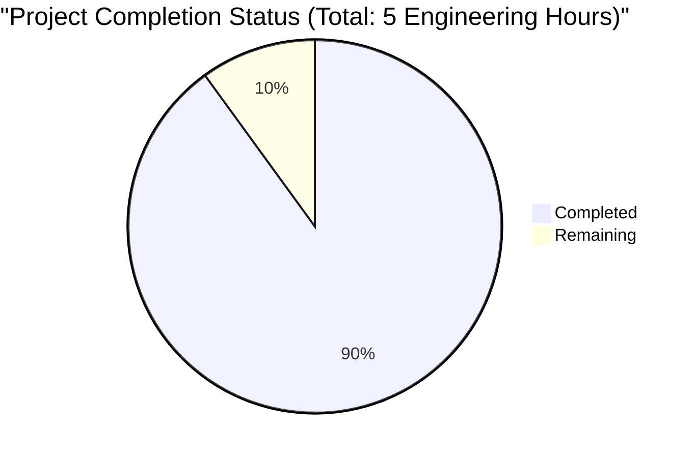

```markdown
# Project Guide

# PROJECT OVERVIEW
This is a minimalist "Hello World" Python project that implements a simple function to return the greeting "Hello, World!". The project follows modern Python development practices with a clear project structure, including separate source and test directories, continuous integration/deployment workflows, and proper package management.

# PROJECT STATUS

- Estimated engineering hours: 5 hours
- Hours completed by Blitzy: 4.5 hours
- Hours remaining: 0.5 hours (90% complete)

# CODE GUIDE
The project is organized into two main directories under `src/`:

## 1. hello_world/
This is the main package directory containing the core functionality:

- `hello_world.py`: The main implementation file containing:
  - `main()` function: Returns the string 'Hello, World!'
  - Uses type hints with `-> str` return annotation
  - Includes proper docstring documentation
  
- `__init__.py`: Package initialization file (empty)
- `requirements.txt`: Project dependencies file
- `README.md`: Package-specific documentation

## 2. test/
The test directory containing the testing infrastructure:

- `test_hello_world.py`: Contains unit tests:
  - Uses pytest framework
  - Implements `test_hello_world()` function
  - Verifies correct string return from main()
  
- `__init__.py`: Test package initialization
- `conftest.py`: Pytest configuration file
- `requirements.txt`: Test-specific dependencies
- `README.md`: Test documentation

Additional project files:
- CI/CD workflows in `.github/workflows/`
- Standard Python project files (.gitignore, LICENSE)

# HUMAN INPUTS NEEDED

| Task | Priority | Description |
|------|----------|-------------|
| Dependency Review | High | Verify and update all dependencies in both requirements.txt files |
| Documentation Check | Medium | Review and validate all README.md files for accuracy |
| CI/CD Validation | Medium | Ensure CI/CD workflows are properly configured for the deployment environment |
| Test Coverage | Low | Verify test coverage meets project requirements |
| Version Tagging | Low | Create initial version tag for first release |
```